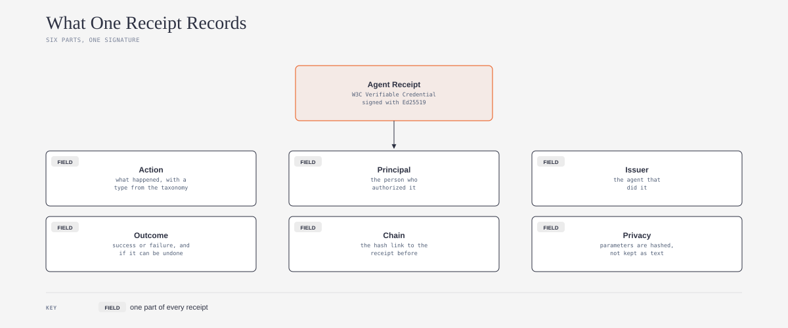

# agent-receipts-explained

## What is it?

This repository is a simple guide and a ready-made skill for your AI agent. Both are based on Agent Receipts, an open protocol for audit trails of AI agent actions. Agent Receipts tells you how to make a signed record, called a receipt, for each action of an agent. It also tells you how to link the receipts in a chain, and how to verify that nobody changed them.


*Do you want simple meanings for the technical words? Refer to the [Jargon Buster](JARGON.md).*

## What problem does it solve?

An AI agent can send an email, delete a file, or run a command for you. Later, a person can ask what the agent did. Many agents keep no record of their actions, and a usual log file is easy to change. Agent Receipts gives each action a signed receipt in a chain. Thus, you can prove what the agent did, and you can see if somebody changed the record.

## Who is it for?

This guide is for small teams, teams that grow quickly, and solo builders who put AI agents into real work. You do not need to be a specialist in risk, cybersecurity, governance, or safety. For example, an agent that changes code, sends messages, or moves files for your team. You do not need to write code to use the skill. The skill uses the open [Agent Skills](https://agentskills.io) format (`SKILL.md`), so it works with Claude, Codex, GitHub Copilot, and other AI agents that support this format.

## Safe by default

1. **Read and draft first.** The skill reads your project and writes a draft plan. It does not install software, change the settings of your agent, or start a signing service before you approve.
2. **No secret keys in the chat.** The skill never asks for a private key, a token, or a password. Do not paste them into the chat.
3. **Honest results.** The skill tells you which actions have no record today. It does not say that your audit trail is complete when the evidence is missing.
4. **Your files stay yours.** The drafts go into your project folder. You can read, change, or delete them at any time.

## What does it do?

Ask your AI agent to check the audit trail of your agent. The skill helps your AI agent to do these steps:

1. Make a list of the tools and actions of your agent
2. Give each action a type and a risk level from the Agent Receipts taxonomy
3. Find the actions that have no record today
4. Select the location of the signing key for your receipts
5. Write a draft receipt plan for the high-risk and critical actions
6. Make a plan to verify the chain and to catch a removed tail

The skill also looks for three frequent mistakes. The first mistake is to keep the signing key inside the agent process, because then the agent can forge receipts. The second mistake is to keep the parameters of an action as plain text, because receipts must keep only hashes. The third mistake is to verify the chain with no checkpoints in an outside place. Chain verification alone cannot find a removed tail.

## How does it work?

*The diagrams below use the visual language of [cathrynlavery/diagram-design](https://github.com/cathrynlavery/diagram-design):*



Each receipt records one action. It shows the person who authorized the action (the principal) and the agent that did the action (the issuer). It also shows the result, and if a person can undo the action. The receipt keeps a hash of the parameters, not the parameters, so private data does not go into the record. The agent signs each receipt, and each receipt holds the hash of the receipt before it.


The signing key controls how much you can trust a receipt. If the key is in the agent process, a compromised agent can forge receipts. The source recommends a separate daemon that holds the key, and it shows hardware or cloud key services as a stronger step. A chain check finds a changed receipt in the middle of the chain. A chain check cannot find receipts that somebody removed from the end. Anchor checkpoints send the newest chain position to a place that the signer cannot change, so you can find this problem.

## How to install

First, make a folder with the name `agent-receipts-audit`. Put `SKILL.md` from this repository in that folder. Then do the steps for your AI agent.

### One command for all agents

If you have Node.js, run this command in a terminal. The command installs the skill for Claude Code, Codex, GitHub Copilot, and other agents.

```
npx skills add ams-builds/agent-receipts-explained
```

To get the latest version later, run `npx skills update`. The command uses [skills](https://github.com/vercel-labs/skills) by [Vercel](https://github.com/vercel-labs). If you do not use a terminal, use the instructions for your agent below.

### Claude

1. In claude.ai or the Claude desktop app, make a zip file of the `agent-receipts-audit` folder.
2. Upload the zip file in **Settings > Capabilities > Skills**.
3. In Claude Code, put the folder in `~/.claude/skills/agent-receipts-audit/`.

### Codex

1. Put the folder in `~/.agents/skills/agent-receipts-audit/` for all your projects.
2. Or, put the folder in `.agents/skills/agent-receipts-audit/` in one project.
3. Or, tell Codex to use `$skill-installer` with the GitHub URL of this repository.
4. If the skill does not show, start Codex again. Source: [Codex skills documentation](https://learn.chatgpt.com/docs/build-skills).

### GitHub Copilot

1. Put the folder in `~/.copilot/skills/agent-receipts-audit/` for all your projects.
2. Or, put the folder in `.github/skills/agent-receipts-audit/` in one repository.
3. Use Copilot in agent mode. Source: [GitHub Copilot skills documentation](https://docs.github.com/en/copilot/how-tos/copilot-cli/customize-copilot/create-skills).

These three agents are the most used AI coding agents in the [JetBrains 2026 survey](https://blog.jetbrains.com/research/2026/08/ai-coding-agent-adoption-2026/). Other agents that support Agent Skills use the same `SKILL.md` file. Refer to the documentation of your agent for the folder.

## How to use it

After you install the skill, speak to your AI agent in your usual words:

- "Check the audit trail of my agent"
- "Can I prove what my agent did last week?"
- "Which actions of my agent need a signed receipt?"

The skill starts automatically. You do not need to use its name.

## Credit and license

This guide is based on [Agent Receipts](https://github.com/agent-receipts/obsigna), the protocol and the Obsigna reference tools, by [Otto Jongerius](https://github.com/ojongerius) and the [Agent Receipts](https://github.com/agent-receipts) project. This guide explains the source at commit `77f36a2` (25 September 2026). The specification document is Draft v0.5.0, and the changelog is at version 0.6.0. The source tools use the Apache License 2.0. The protocol specification in the `spec/` folder of the source uses the MIT License.

This repository uses the Apache License 2.0 and keeps the MIT notice for the specification. Refer to [LICENSE](LICENSE) and [NOTICE](NOTICE).

This is an independent guide. It is not an official part of the source project. For the full rules, use the source specification.

Changes from the source:

1. I wrote the main concepts again in Simplified Technical English, for readers who are not specialists.
2. I made three new diagrams.
3. I wrote an agent skill that applies the protocol to one agent.
4. I did not copy the specification, the SDKs, the daemon, or the test vectors. The skill refers to them by their file paths in the source repository.

**Language.** I wrote the text in Simplified Technical English (ASD-STE100). The idea to ask an AI model to write in ASD-STE100 comes from [Andrej Karpathy](https://github.com/karpathy) ([his post on X](https://x.com/karpathy/status/2105819303471976479)). I used the [simplified-technical-english](https://github.com/0xpili/simplified-technical-english) agent skill by [pili](https://github.com/0xpili) to write and check the text. ASD-STE100 is a specification of ASD (AeroSpace and Defence Industries Association of Europe). This repository is not related to ASD.

---

*New words? The [Jargon Buster](JARGON.md) gives plain-English explanations of receipt, chain, principal, issuer, anchor checkpoint, tail truncation, and more.*
